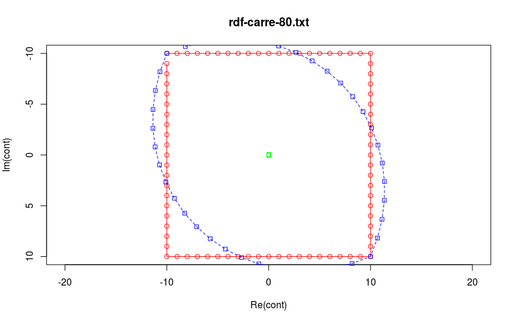
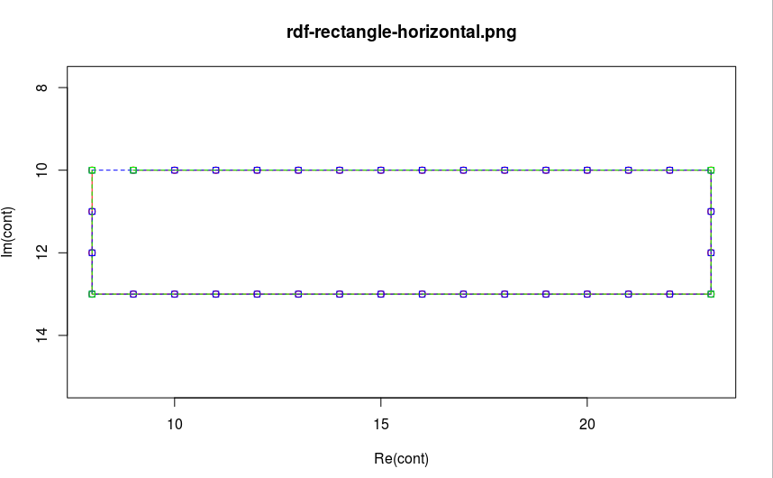

ALDER Hugo
FEVRE Corwin

# Compte-rendu RDF : TP2

## But du TP

L'objectif de ce TP est de comparer 2 méthodes de reconnaissance de formes. La première consiste à utiliser les descripteurs de Fourier. La seconde met à contribution l'algorithme de la corde.

Dans les 2 cas, on obtient une manière plus compacte de représenter une forme initiale. Nous allons donc essayer de découvrir lequel de ces algorithmes est le plus adapté selon une forme donnée.

## Code R

#### Comment sont codés les points du contour dans la variable cont ?

Dans la variable cont, les coordonnées d'un point sont codées grâce à des nombres complexes.

#### Quel est l'intérêt du dernier argument de la méthode plot ?

Le dernier argument de la méthode plot, ylim, sert à indiquer la valeur minimale et maximale de l'axe y.

* `Im (cont)` : parties imaginaires de la variable cont
* `range (Im (cont))` : indique la valeur minimale et maximale du résultat ci-dessus
* `rev (range (Im (cont)))` : inverse (reverse) les valeurs obtenues ci-dessus

#### En ne conservant qu'un point sur 4, puis un point sur 8, constituer deux autres contours approchant la forme circulaire et les afficher respectivement en bleu et en vert dans la même fenêtre.

Voir image ci-dessous.

## Descripteurs de Fourier

#### Calculer les descripteurs de Fourier du contour contenu dans le fichier rdf-carre-80.txt en utilisant la fonction fft de R, normalisée en divisant par le nombre de points.

Voir image ci-dessous. Les descripteurs de Fourier sont ici représentés en bleu. Il s'agit en fait d'une autre façon de représenter le carré.

Si on effectue l'inverse de cette transformation de Fourier, on retrouve bien la forme du carré initial (en rouge).

#### A quoi correspond le descripteur de Fourier Z0 d'une forme décrite par son contour ?

Le descripteur de Fourier Z0 correspond au centre de gravité d'une forme en coordonnées complexes.

#### Filtrage des descripteurs de Fourier

Ci-dessous, on peut voir que si on élimine 50% (ratio de 0.5) des descripteurs de Fourier, on obtient la figure bleue.
Si on enlève la totalité des descripteurs de Fourier, on obient la figure verte, qui correspond au centre de gravité.
Enfin, si on enlève aucun descripteur de Fourier, on retrouve la forme initiale.

De fait, nous avons confirmation que plus la signature est compacte, plus le contour reconstitué est simplifié.

## Réduction d'une chaîne de contour

Dans cette partie, on s'attarde plus particulièrement sur l'algorithme dit de la corde. Son but est de diminuer le nombre de points utilisés pour décrire une forme en ne gardant que les points nécessaires selon un distance maximale fixée préalablement.

Sur l'image ci-dessous, on peut observer le contour initial d'un cercle (en rouge).On peut aussi observer ce même contour en utilisant une distance maximale de 0.5 pixel (en bleu), et avec une distance maximale de 1 pixel (en violet).

En somme, plus cette distance maximale est grande, plus la forme obtenue sera éloignée de la forme initiale.

## Comparaison des deux approches

* Descripteurs : couleur bleue
* Corde : couleur verte

| Forme     | Résultats               | Ratio (Fourier) |  Dmax (Corde)     |
| :--------:|:-----------------------:|:---------------:|:-----------------:|
| Rectangle |   | 1               | 2                 |
| Carré     |    | 1               | 10                |
| Triangle  |    | 1               | 1                 |
| Croix     |  | 1               | 1                 |
| Patatoïde |    | 1               | 1                 |

## Conclusion

D'après les informations récoltées durant ce TP, on se rend compte que les résultats obtenus grâce aux descripteurs de Fourier sont plus précis que les résultats obtenus par l'algorithme de la corde dès qu'il s'agit de reconnaître des formes naturelles. Mais cette méthode donne vite des résultats qui s'éloignent de la forme initiale si on baisse trop le pourcentage de valeurs utilisées.

L'algorithme de la corde est quant à lui efficace pour reconnaître des formes géométriques constituées de lignes droites, et permet de compresser un maximum ces données en faisant varier dmax. Cependant, il est très peu utile dans l'exemple de la patatoïde.

En conclusion, il faut adapter la méthode utilisée selon le type de forme à étudier.
