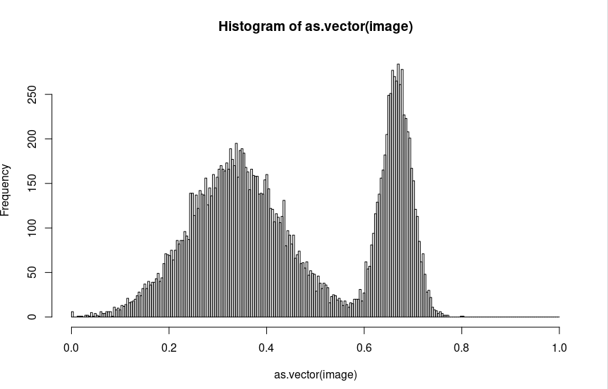
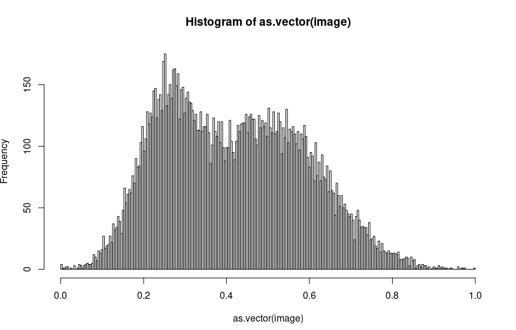

ALDER Hugo

# Compte-rendu RDF : TP3

## But du TP

L'objectif de ce TP est de manipuler les histogrammes d'une image et de la binariser, c'est à dire de la faire passer d'une image en nuances de gris en une image en noir et blanc.
Nous commencerons par étudier la binarisation par niveaux de gris. Nous nous pencherons ensuite sur la binarisation par niveaux de texture.

## Code R

### A quoi correspond l'argument nbins utilisé pour calculer l'histogramme des niveaux de gris ?

La valeur nbins correspond aux nuances des niveaux de gris disponibles.

### Modifier la valeur de la variable seuil et commenter les résultats.

La variable seuil détermine si une nuance de gris doit être considérée comme blanche ou noire lors de la binarisation.
Les valeurs supérieures à `seuil * nbins` sont considérées comme noires, alors que les valeurs inférieures seront considérées comme blanches.

## Histogramme des niveaux de gris

### Tableau récapitulatif

| Texture                          | Histogramme        | Seuil |  Binarisation     | Différence |
| :-------------------------------:|:------------------:|:-----:|:-----------------:|:-----------|
|  |  | 0.5   |  | 0.12%      |
|  |  | 0.55  |  | 1%         |
|  |  | 0.35  |  | 24%        |
|  |  | 0.4   |  | 24%        |
|  |  | 0.45  |  | 56%        |

### En résumé

Pour les images 1 et 2, on obtient des résultats plus que corrects.
Pour les autres images, beaucoup plus bruitées, cette technique de binarisation ne donne pas de résultats satisfaisants. Le pourcentage de différence avec l'image de référence se met rapidement à grimper.

On ne peut donc pas utiliser ce seul attribut de segmentation sur les images trop bruitées. Il faut donc utiliser un autre critère que celui du niveau de gris.

## Histogramme des niveaux de texture

### La fonction rdfTextureEcartType

Cette méthode calcule la moyenne des niveaux de gris des pixels voisins d’un pixel, pour ensuite soustraire cette moyenne à son propre niveau de gris.

Pour calculer cette moyenne, on utilise rdfMoyenneImage, qui détermine quels sont ces pixels voisins.
La nouvelle matrice ‘carre’ crée, on va stocker sa racine carré dans écart.

Enfin, on normalise en divisant les valeurs de la matrice par la valeurs maximum de celle ci, afin de revenir à des valeurs comparables.

### Tableau récapitulatif

| Texture                          | Histogramme        | Seuil |  Binarisation          | Différence |
| :-------------------------------:|:------------------:|:-----:|:----------------------:|:-----------|
|  |  | 0.48  |  | 34%        |
|  |  | 0.32  |  | 9%         |
|  |  | 0.45  |  | 6%         |
|  |  | 0.36  |  | 3.5%       |
|  |  | 0.38  |  | 2.5%       |

### En résumé

Grâce à cette méthode, nous avons donc réduit le pourcentage de différence moyen pour toutes les images, sauf la première.
Cependant, on obtenait des résultats intéressants pour l'image 1 avec une binarisation par niveaux de gris.

Il faudrait donc pouvoir utiliser plusieurs attributs lors de la binarisation des images afin d'obtenir des résulstats optimaux. C'est ce que nous allons voir dans la partie suivante.

## Histogramme conjoint

On peut partir du principe qu'une binarisation combinant les 2 méthodes précédentes donne des résultats plus proches d'une image parfaite.

## Conclusion

Au cours de ce TP, nous avons vu que selon la nature de l'image de base, il peut être intéressant de la binariser selon tel ou tel critère. Cependant, plus le nombre de critères est important, plus le résultat final a des chances de s'approcher de l'image originel.
